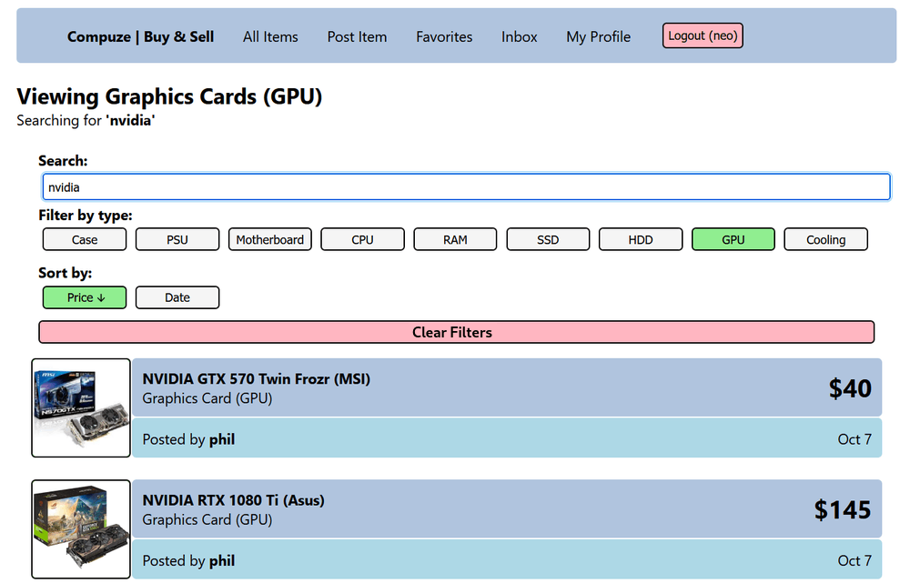

# Compuze

A platform to facilitate buying and selling used computer parts

### Dev dependencies

- NodeJS & Nodemon
- MySQL/MariaDB
- Docker (Optional)

### Running the development environment manually

- Clone the repo
- Create a local MySQL database
- Edit the environment variables in the .env files
- Install dependencies & run dev servers in both ./backend & ./frontend directories: `npm install && npm run dev`
- By default, the frontend will be served at localhost:3000 and the backend at localhost:5500
- During development, the db will be filled with fake items & 2 users: `seller1, pass: 123123oO` `seller2, pass: 123123oO`

### Running the development environment using the provided script

- If your system has tmux, neovim & docker installed, running the `dev.sh` script will setup a dev environment

### Disable populating the database with fake data during development

- Modify the backend's .env file and set FAKE_DATA to 0 `DEFAULT: 1`

### Documentation

- The <a href="https://github.com/kiwphi/compuze/blob/master/docs/API.md">API Documentation</a> has information about the API's endpoints
- A basic linux <a href="https://github.com/kiwphi/compuze/blob/master/docs/DEPLOYMENT.md">deployment guide</a>

### Screenshots

#### Viewing a single item

#### Browsing items with some filters on

#### Inbox

